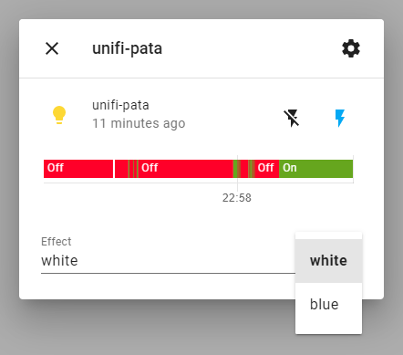

# homeassistant-unifi-led
Control UniFi access point LEDs via Home Assistant. This takes data via MQTT (with MQTT discovery) and controls lights of the access points via SSH. See config.example.json for configuration sample.

On startup, this should create a new Home Assistant device for each Access Point.
Each device has a state (ON/OFF) and an effect (white/blue).



# Warning:
This is just a proof of concept.

It is a **bad idea** to have your UniFi root SSH credentials in a config file on some random server, also there is very little error handling and logging if something goes wrong.

**Thus, you should probably not use this in a productive environment.**

# Installation:
If you're not experienced with docker & docker-compose, you should probably ask someone for help who does.

Make sure you cloned the repository **including all submodules** (`git clone --recurse-submodules`)!

A development `docker-compose.yml` and an example config under `src/HomeAssistantUnifiLed/config.example.json` are provided.

## Example
probably the fastest way to get this going would be:
```
git clone --recurse-submodules https://github.com/patagonaa/homeassistant-unifi-led.git
cd homeassistant-unifi-led
cp src/HomeAssistantUnifiLed/config.example.json src/HomeAssistantUnifiLed/config.json
```
then edit `src/HomeAssistantUnifiLed/config.json` to add your MQTT server and access points (with SSH credentials).
then start the app using
```
docker compose up -d --build
```
but keeping the config file there probably isn't a good idea
